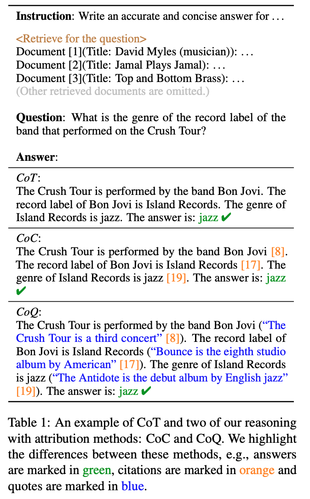

# Notes on Generation with Additions

## [Making Long-Context Language Models Better Multi-Hop Reasoners](https://arxiv.org/pdf/2408.03246)

<!--stackedit_data:
eyJoaXN0b3J5IjpbMTMwNjIzOTM2OCwxODQ3MDM3NTY1LC0xMz
ExNDc2NTU1LDk0NDAwNDE2N119
-->